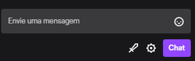
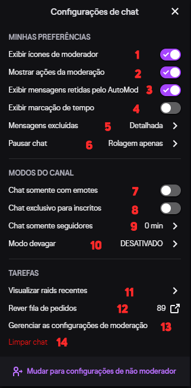

<h1 align="center">Funções Básicas</h1>

## **Delete/Timeout/Ban**

As principais funções e também mais básicas são as famosas: **Delete Message**, **Timeout** e **Ban**. Você pode utilizar elas manualmente (usando os ícones no chat) ou por comando (/timeout [username] [duration] e /ban [username] [reason] ). Caso os ícones de moderadores não estejam aparecendo para você, que geralmente ficam do lado esquerdo do nick do usuários no chat, vou explicar como habilitar essa opção agora com as funções manuais.

----

## **Funções Manuais**

----

As funções manuais são aquela funções onde você não digita nenhum comando para usar elas mas sim ir diretamente nas opções do chat e utiliza-las.

 

>Clicando na engrenagem vai abrir a seguinte aba.

  
**1** - Nessa box que você habilita para que apareça os icones do lado esquerdo do nick dos usuários do chat, onde na respectiva ordem aparecem os ícones de Delete, Timeout e Ban.  
**2** - Mostra no chat as ações como: banimento de usuário, timeout com o seu tempo de duração e etc.  
**3** - Se essa opção estiver ativada, as mensagens barradas pelo AutoMod (irei explicar em outro tópico sobre) aparecem para você, e fica a sua escolha se deixa a mensagem passar ou não.  
**4** - Mostra a hora (real time) que a mensagem foi enviada no chat.  
**5** - Essa opção você escolher como vai aparecer quando uma mensagem for excluída: Detalhada, Resumida ou Legado.  
**6** - Opção muito importante para um moderador, principalmente quando tem que moderar um canal com chat muito movimentado, pode escolher: Rolagem apenas, Sobreposição do mouse (quando o ícone do mouse ficar na parte sem mensagem do chat, ele vai travar a rolagem), Segurar a tecla Alt (eu particulamente prefiro essa) e Sobreposição do mouse/Tecla Alt.  
**7** - Ativa/desativa o modo chat só com emotes.  
**8** - Ativa/desativa o modo chat exclusivo para inscritos/subs.  
**9** - Ativa/desativa o modo chat só de seguidores, com o determinado tempo necessário de follow no canal.  
**10** - Ativa/desativa o modo devagar do chat, podendo colocar um tempo pré-definido para mandar mensagem de novo.  
**11** - Visualiza as raids recentes no canal.  
**12** - Visualiza a fila de pedidos com pontos do canal.  
**13** - Abre a interface do moderador (explicarei no próximo módulo melhor sobre ela).  
**14** - Essa opção limpa o chat todo.  
  
Pronto, lembrando que toda essa parte manual o moderador pode fazer utilizando comandos, tópico que vai ser explicado melhor no módulo **[4.Comandos](/contents/4.Comandos)**.

----
Voltar para: [1.Introdução](/contents/1.Introducao.md) | [Início](/README.md) | Ir para: [3.Interface do Moderador](/contents/3.Interface.md)