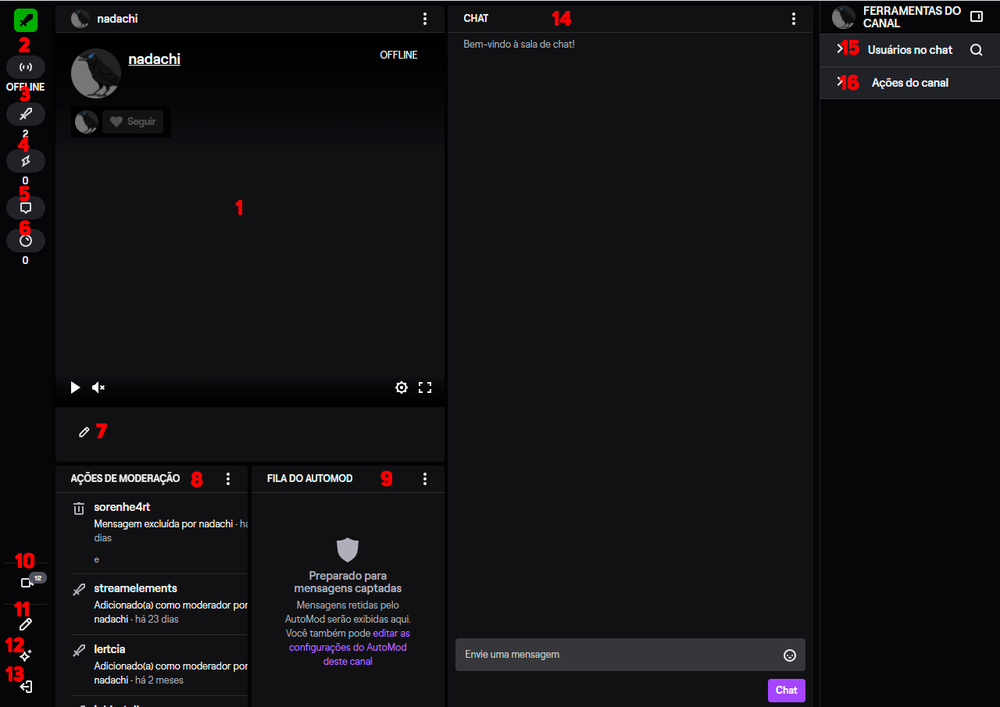

<h1 align="center">Interface do Moderador</h1>

Nesse módulo vou explicar como funciona toda a interface do moderador, que na minha opinião, melhora muito o trabalho do moderador, principalmente que tem a opção de mover cada parte dela para qualquer parte da página que você achar melhor.  

>Aqui está a interface do moderador.

1. Tela onde aparece a live.  
2. Símbolo que mostra se o canal está online ou offline.  
3. Mostra todos os moderadores dos canais e quais estão online.  
4. Atividades que ocorreram no canal (follows, subs, cheers, resgates) com um limite de mostrar 199.
5. Sussurro da Twitch.  
6. Resgates feitos nos canais.  
7. Opção para alterar dados da live (título, game, etc).  
8. Ações feita pelos moderadores da live.  
9. Fila de mensagens do AutoMod (vai ser explica sobre nesse [módulo](/contents/7.AutoMod.md)).  
10. Canais que o moderador segue que estão ao vivo.  
11. Edita a interface do moderador, podendo adicionar mais widgets.
12. Onde mostra sobre as atualizações feitas na interface do moderador e também local para enviar feedback sobre.
13. Para sair da interaface do moderador.  
14. Chat da live.  
15. Mostra os usuários ativos no chat.  
16. Ações que o moderador pode fazer no canal, nas quais eu vou explicar na imagem a seguir. 
17. Não mostra na imagem pois foi uma atualização nova, mas surgiu a opção de "requisição de desban", aparece em baixo dos resgates feitos no canal, nele é onde vai aparecer a requisição das pessoas que foram banidas no canal pedindo desban.

+ 16.1. Chat somente com emotes.
+ 16.2. Chat somente para seguidores. 
+ 16.3. Modo devagar para o chat.
+ 16.4. Essa opção, é um das mais importantes das Ações do Canal, nela é onde o moderador pode bloquear as palavras que não passaram no chat (barradas pela regras do chat), onde no módulo de [5.Palavras Bloqueadas](/contents/5.Palavras.md) cito quais eu bloqueo como padrão nos chats. Obs: uma coisa que muito moderador não sabe, mas se usar o * tem como bloquear qualquer variação da palavra, ex: mong* -> vai bloquear mongoloide, mongol e etc.
+ 16.5. Opção onde pode colocar os termos permitidos no chat para o AutoMod não barrar, eu particularmente nunca usei ela.  
+ 16.6. Serve para abrir o painel de controle do criador.
+ 16.7. Mostra as raids recentes que houveram no canal.

A primeira vez que o moderador abre essa interface parece muito confusa, mas vendo esse módulo aqui, até que é bem daora né?

----
Voltar para: [2.Funções Básicas](/contents/2.Funcoes.md) | [Início](/README.md) | Ir para: [4.Comandos](/contents/4.Comandos.md)