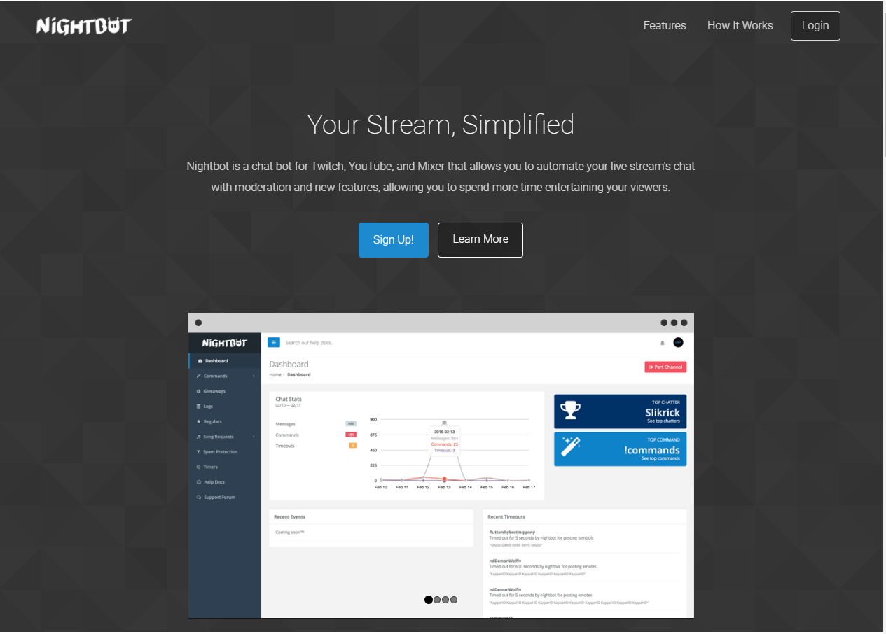
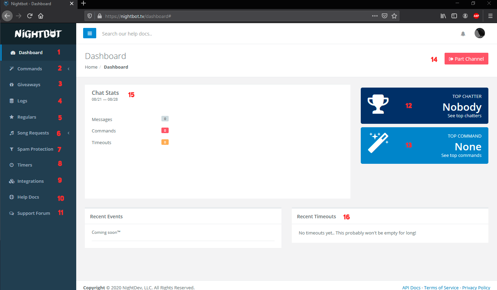

<h1 align="center">Bots para Twitch 🤖</h1>

Você enquanto estava em alguma live já percebeu que sempre tem um usuário com mod que fica postando as mesmas mensagens no chat? Grandes chances dele ser um bot feito para chat da Twitch.  

Esses bots tem como função auxiliar as lives em vários sentidos como: controle de spam, proibir links ou ter comandos próprios. Nesse módulo vou explicar sobre os dois mais usados: [**Nightbot**](#Nightbot) e [**StreamElements**](#StreamElements).

# Nightbot

>O nightbot se eu não estiver enganado é um dos bots mais antigos, ele pode ser utilizado tanto na Twitch quanto no youtube, com ele você pode criar comandos customizáveis e até mesmo fazer sorteios na live, agora vou explicar como funciona ele, principalmente sua dashboard.

Para começar a usar o Nightbot, o primeiro passo é acessar o site: https://nightbot.tv/  

  

Depois de acessado o site, clique em "Sign Up!" em seguida vai pedir para logar com Twitch ou Youtube, clica para ir pela twitch e autoriza o aplicativo.

E pronto você agora está na dashboard do Nightbot.

  

Agora vou explicar o que é cada opção que está sinalizada com um número:  

**1** - A própria Dashboard, se você estiver em outra opção, clicando aqui você retorna para cá.  
**2** - A parte onde o moderador vai passar mais tempo, Comandos, pode se encontrar aqui os comandos padrões do Nightbot ou criar comandos customizáveis. (mais pra frente vou explicar melhor sobre)  
**3** - Giveaways, aqui serve para fazer sorteios durante a live, segue o mesmo estilo do StreamLabs.  
**4** - Logs é onde fica armazenado o histórico do chat do canal onde está o bot.  
**5** - No Regulars, você pode criar permissões extras para os usuários do chat.  
**6** - Song Requests, onde tem algumas playlists feitas pelo próprio nightbot ou também a fila de músicas pedidas pelo chat.  
**7** - Spam Protection, aqui é onde tem as medidas de seguranças para as lives utilizando o nightbot, nele você pode bloquear links, excessos de símbolos, emotes ou Caps e também bloquear certas palavras.    
**8** - Timers, aqui é onde acontece a mágica de fazer o bot mandar mensagem automaticamente no chat (vou explicar melhor mais para frente).  
**9** - Aqui você pode integrar o nightbot com outras plataformas, inclusive com o Discord, sim, você pode usar o seu nightbot no discord e ter seus comandos nele.  
**10** - Aqui é onde fica a Doc do Nightbot que por sinal é muito boa.  
**11** - Comunidade do Nightbot.  
**12** - Pessoa que mais manda mensagem no período de 15 dias.  
**13** - Comando mais usado no período de 15 dias.  
**14** - Nesse botão você pode expulsar ou chamar o nightbot no seu canal.  
**15** - Mostra a estatística do canal em termos de comandos, timeouts e mensagens no chat.  
**16** - Timeouts recentes dado pelo bot.
 
## Comandos do Nightbot

----
Voltar para: [5.Palavras Bloqueadas](/contents/5.Palavras.md) | [Início](/README.md) | Ir para: [7.AutoMod](/contents/7.AutoMod.md)