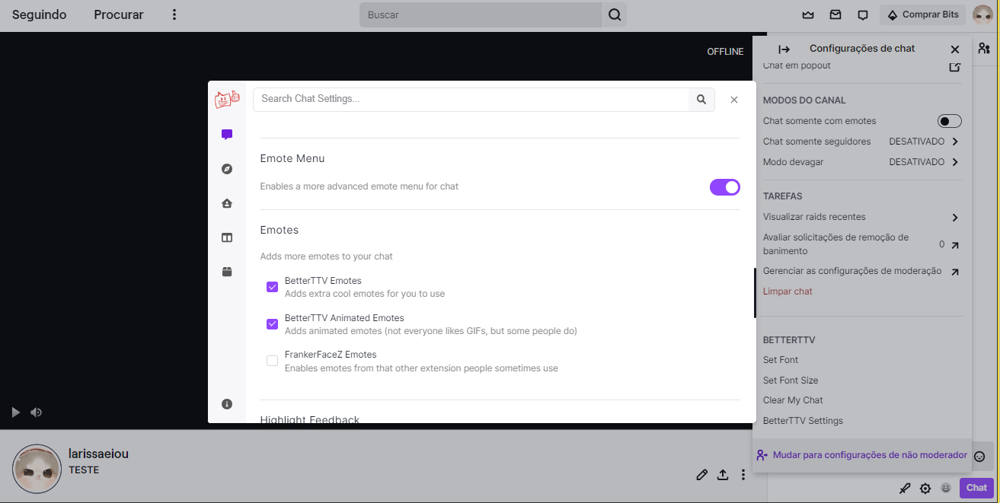
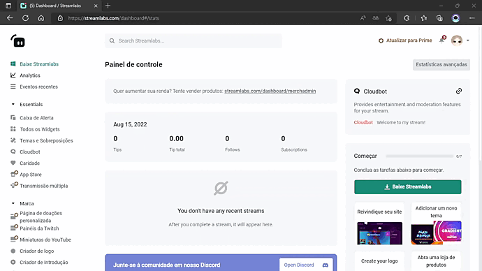

# Integrações de Terceiros

## BTTV 
> BTTV é uma extensão de navegador que te dá acesso a milhares de  emoticons e gifs para serem usados na sua live da Twitch *gratuitamente*, além de permitir que você adicione os seus próprios emotes! Usar essa extensão pode deixar as interações do chat mais *legais*, afinal, que pessoa não iria querer usar um emote de gatinho dançarino?

## Como usar: 

1. Acesse (https://betterttv.com/) > selecione seu navegador e clique para fazer o download > abrirá a loja de extensões do Google e nela clique para obter  a extensão “BETTER TV”, aceite as permissões solicitadas. 
2. Volte a página inicial da BTTV e clique em [Login], use sua conta da Twitch para vincular. Você será redirecionado ao dashboard da BTTV e caso tenha seus próprios emotes, é só clicar em [upload emotes] E se você não tiver, sem problemas, clique em [emotes] localizado no menu e verá milhares já disponíveis, basta clicar e adiciona-los.

   

3. Tudo certo até aqui? Vá até seu chat da Twitch, clique em [⚙️] ⇒ [bettertv settings], procure por “Emote Menu” e “Emotes” e habilite todas as caixinhas. 

  
 
***Repare que foi criado um botão [😀] abaixo no chat, o que facilita encontrar os bttv emotes.
Prontinho! Agora é só usar e abusar dos novos emotes :p***

# HORA DOS CHATBOTS

> O que são? Onde vivem? Para que servem? Bom, vamos lá: 
Esses bots tem como função auxiliar as lives em vários sentidos como: controle de spam, proibir links ou ter comandos próprios. É como se você tivesse um secretario de live, você precisa delegar suas funções e é pra ele que vai passar. 
Não quer que alguma palavra seja usada no seu chat? Você comunica ele e se alguém falar, ele vai automaticamente (banir ou dar timeout, isso você decide também). Existem vários bots disponiveis, listar todos seria ~~chato~~ então citarei 3 dos mais conhecidos:

## Streamlabs 

## Como usar: 

1. Acesse (https://streamlabs.com/pt-br/cloudbot) e faça login com sua conta da Twitch > Você será direcionado ao dashboard e caso esteja em inglês, você pode mudar isso clicando no seu icone no canto superior direito e até mudar o tema.
2. Procure e clique em [Cloudbot] no menu vertical a esquerda > Ative o bot. Vá até seu chat da twitch e digite "/mod StreamLabs" e agora sim ele está 100% vinculado a sua live. 
3. Na pagina [Cloudbot] será exibida todas ferramentas que podem ser ativadas/desativadas e até criadas por você! 

- RECOMENDAÇÃO: 
  
  - Habilite proteção de palavra. Clique em [preferencias] > [lista negra] > [adicionar palavra/frase] e então um modal será exibido para você adicionar palavras que ***NÃO** quer que sejam usadas no seu chat. Você também tera que escolher qual punição será dada caso alguém digite [banir, timeout, purge]

  

## StreamElements 

## Como usar: 

1. Acesse (https://streamelements.com/) e faça login com sua conta da Twitch. Você será direcionado ao dashboard e caso esteja em ingles, você pode mudar isso clicando no seu icone no canto superior direito e até mudar o tema.
2.  Clique em [Bot do chat]> [Filtro de spam] e então será exibido uma lista e você podera habilitar proteção de palavra, de links etc assim como foi no StreamLabs.
3. Se quiser criar comandos, por exemplo: "!social" em que o bot envia o link de suas redes sociais basta: Clicar em [Bot do chat] > [Comandos do chat] > [Comandos personalizados] > [Adicionar novo comando] 

  

## Nightbot 

## Como usar: 

1. Acesse (https://nightbot.tv/) > clique em "Sign Up!" em seguida vai pedir para logar com Twitch ou Youtube, clica para ir pela twitch e autoriza o aplicativo. 
2. Agora você está no dashboard. 
3. Para habilitar os filtros, clique em [Proteção contra SPAM] e será exibida uma lista de filtros que você pode habilitar e configurar a sua necessidade clicando em [Opções]

Caso queira aprofundar mais sobre como aproveitar o maximo dos bots: [Bots](../6.Bots.md)

